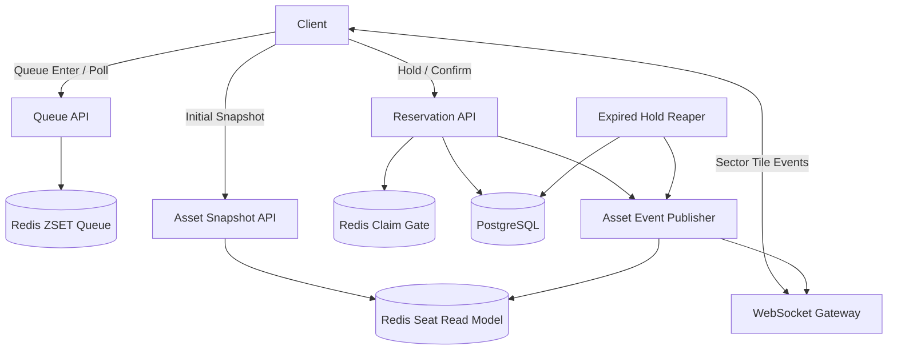

# Rush Seat

대규모 예매 오픈 상황을 가정한 좌석 예약 시스템.

목표는 단순 예약 CRUD가 아니라, **대기열 기반 트래픽 제어**, **10만 좌석 실시간 상태 동기화**, **좌석 선점 경쟁 완화**, **초과 예약 방지**, **부하 테스트 기반 성능 검증**을 구현하는 것이다.

---

## 1. Problem

대규모 예매 서비스에서는 특정 시점에 사용자가 몰리면서 다음 문제가 발생한다.

- 모든 사용자가 동시에 예약 API를 호출하여 DB connection pool이 고갈된다.
- 좌석이 화면에는 남아 보이지만, 클릭하면 이미 선점되었다는 실패가 발생한다.
- 좌석 상태 변경 이벤트를 전체 사용자에게 broadcast하면 WebSocket 이벤트 수가 과도하게 증가한다.
- 동시 클릭 상황에서 중복 선점, 초과 예약, stale snapshot 문제가 발생한다.
- 성능 개선 여부를 감이 아니라 p50 / p95 / p99 / error rate / false-positive click failure rate로 검증해야 한다.

이 프로젝트는 위 문제를 직접 재현하고, 구조적으로 완화하는 것을 목표로 한다.

---

## 2. Goals

### Functional Goals

- 10만 좌석 규모의 이벤트를 생성할 수 있다.
- 사용자는 Redis 기반 대기열을 통해 순차적으로 예매 화면에 진입한다.
- 대기열 통과 후 admission token을 받은 사용자만 좌석 선택 화면에 진입할 수 있다.
- 사용자는 전체 좌석이 아니라 현재 보고 있는 sector-tile의 좌석 상태만 WebSocket으로 수신한다.
- 좌석 클릭 시 즉시 hold 요청을 수행한다.
- 좌석 hold는 PostgreSQL 조건부 update 성공 시에만 인정한다.
- hold된 좌석은 TTL 내에 confirm되지 않으면 자동 release된다.
- 예약 확정 시 `HELD -> RESERVED` 상태로 전이된다.
- 초과 예약과 중복 hold는 발생하지 않아야 한다.

### Performance Goals

초기 목표값은 다음과 같다.

| Metric | Target |
|---|---:|
| Total seats | 100,000 |
| Queue enter attempts | 100,000 ~ 1,000,000 |
| Subscription tile size | 300 ~ 700 seats |
| Default tile size | 500 seats |
| Display sectors | 20 ~ 50 |
| Subscription tiles | 약 200 |
| Concurrent WebSocket clients | 1,000 ~ 5,000 |
| Client subscribed tiles | 1 ~ 3 |
| Hold request rate | 300 ~ 500 rps |
| Hold API p95 | < 500ms |
| Hold API p99 | < 1s |
| WebSocket propagation p95 | < 300ms |
| WebSocket propagation p99 | < 1s |
| Snapshot API p95 | < 500ms |
| False-positive click failure rate | < 0.5% |
| Oversell count | 0 |
| Duplicate hold count | 0 |

---

## 3. Core Design

### 3.1 Queue

대기열은 Redis Sorted Set으로 관리한다.

```text
queue:waiting:{eventId}
member = userId
score  = joinedAtMillis
```

대기열의 역할은 예약 성공 보장이 아니라, **예매 화면 진입량 제어**다.

```text
Queue passed = seat selection screen admission
Queue passed != seat reserved
```

### 3.2 Seat State

좌석은 다음 상태를 가진다.

```text
AVAILABLE
  -> CLAIMING
  -> HELD
  -> RESERVED
```

| State | Meaning |
|---|---|
| AVAILABLE | 선택 가능 |
| CLAIMING | 누군가 방금 선택 시도 중 |
| HELD | 특정 사용자가 제한 시간 동안 선점 |
| RESERVED | 예약 확정 |

`CLAIMING`은 UX 완화를 위한 짧은 상태다.  
최종 정합성은 PostgreSQL의 조건부 update로 보장한다.

---

## 4. Sector / Tile Model

10만 좌석 전체의 변경 이벤트를 모든 사용자에게 broadcast하지 않는다.

구독 단위는 다음처럼 나눈다.

```text
Event
 ├─ Display Sector A
 │   ├─ Tile A-01: 약 500 seats
 │   ├─ Tile A-02: 약 500 seats
 │   └─ ...
 ├─ Display Sector B
 └─ Display Sector C
```

구분:

| Concept | Purpose |
|---|---|
| Display Sector | 사용자에게 보이는 공연장 구역 |
| Subscription Tile | WebSocket 구독 및 delta push 단위 |

예를 들어 A구역이 5,000석이라면, WebSocket topic은 A구역 하나가 아니라 `A-01 ~ A-10` tile로 분할한다.

---

## 5. Architecture



### 5.1 Deployment / Scaling Strategy

100만 부하는 모든 요청을 예약 처리까지 통과시키는 것이 아니라, 대기열에서 흡수하고 실제 write path 유입량을 제한하는 방식으로 처리한다.

```text
1,000,000 queue enter attempts
  -> Redis waiting queue
  -> admission control
  -> 5,000 ~ 20,000 admitted users
  -> 1,000 ~ 5,000 WebSocket clients
  -> 50,000 ~ 200,000 hold attempts
  -> 300 ~ 500 rps PostgreSQL conditional update
```

초기 배포와 목표 부하 배포는 구분한다.

| Stage | Deployment | Purpose |
|---|---|---|
| Initial | app x 1, Redis x 1, PostgreSQL x 1 | 기능 검증 |
| Target Load | app x 3~4, Redis primary x 1, PostgreSQL primary x 1 | 100만 queue enter / WS fanout 검증 |
| Optional HA | Redis primary + replica/Sentinel, PostgreSQL primary + read replica | 장애 대응 / 조회 분리 |

Replica 판단:

- API / WebSocket 서버 replica는 필요하다. HTTP 요청 처리, WebSocket 연결 유지, tile fanout을 수평 확장하기 위함이다.
- PostgreSQL read replica는 핵심 예약 처리 성능에는 직접 도움이 되지 않는다. `AVAILABLE -> HELD` 전이는 primary write이기 때문이다.
- Redis replica는 write scale-out 수단이 아니라 HA 또는 read offload 용도다.
- WebSocket 서버를 여러 대로 늘리면 Redis Pub/Sub 기반 backplane을 사용해 asset state event를 모든 app replica에 전달한다.

```text
Load Balancer
  ├─ app-1: HTTP API + WebSocket
  ├─ app-2: HTTP API + WebSocket
  ├─ app-3: HTTP API + WebSocket
  └─ app-4: HTTP API + WebSocket

Redis primary
PostgreSQL primary
Redis Pub/Sub backplane for WebSocket fanout
```

---

## 6. User Flow

```text
1. User enters event page
2. User joins Redis waiting queue
3. Queue rank reaches admission range
4. Server issues admission token
5. User enters seat selection screen
6. Client fetches initial sector/tile snapshot
7. Client subscribes to visible tiles through WebSocket
8. User clicks a seat
9. Server acquires Redis claim gate
10. Server broadcasts CLAIMING to the tile
11. Server attempts PostgreSQL conditional update
12. If success, seat becomes HELD
13. If payment/confirm succeeds, seat becomes RESERVED
14. If hold expires, seat becomes AVAILABLE again
```

---

## 7. API Draft

### Queue

```http
POST /events/{eventId}/queue
GET  /events/{eventId}/queue/me
```

Example response:

```json
{
  "status": "WAITING",
  "rank": 1532,
  "estimatedWaitSeconds": 90
}
```

When admitted:

```json
{
  "status": "ADMITTED",
  "admissionToken": "at_xxx",
  "expiresAt": "2026-06-29T18:10:00+09:00"
}
```

---

### Sector Summary

```http
GET /events/{eventId}/sectors/summary
Authorization: Bearer {admissionToken}
```

```json
{
  "eventId": 1,
  "version": 8821,
  "sectors": [
    {
      "displaySectorId": "A",
      "availableCount": 4210,
      "heldCount": 300,
      "reservedCount": 490
    }
  ]
}
```

---

### Tile Snapshot

```http
GET /events/{eventId}/tiles/{tileId}/assets
Authorization: Bearer {admissionToken}
```

```json
{
  "eventId": 1,
  "tileId": "A-01",
  "tileVersion": 119,
  "assets": [
    {
      "assetId": 100231,
      "code": "A-12-03",
      "x": 120,
      "y": 88,
      "status": "AVAILABLE",
      "assetVersion": 8
    }
  ]
}
```

---

### WebSocket

```text
WS /ws/events/{eventId}?token={admissionToken}
```

Subscribe request:

```json
{
  "type": "SUBSCRIBE_TILE",
  "eventId": 1,
  "tileId": "A-01",
  "lastSeenTileVersion": 119
}
```

Asset changed batch:

```json
{
  "type": "ASSET_CHANGED_BATCH",
  "tileId": "A-01",
  "tileVersion": 120,
  "publishedAt": "2026-06-29T18:00:01.120+09:00",
  "changes": [
    {
      "assetId": 100231,
      "status": "HELD",
      "assetVersion": 9,
      "holdExpiresAt": "2026-06-29T18:03:00+09:00"
    }
  ]
}
```

Resync required:

```json
{
  "type": "TILE_RESYNC_REQUIRED",
  "tileId": "A-01",
  "currentTileVersion": 130
}
```

---

### Hold

```http
POST /events/{eventId}/assets/{assetId}/hold
Authorization: Bearer {admissionToken}
Idempotency-Key: {idempotencyKey}
```

Request:

```json
{
  "tileId": "A-01",
  "observedAssetVersion": 8,
  "observedTileVersion": 119
}
```

Success:

```json
{
  "holdToken": "ht_xxx",
  "assetId": 100231,
  "status": "HELD",
  "expiresAt": "2026-06-29T18:03:00+09:00"
}
```

Failure:

```json
{
  "code": "ASSET_ALREADY_HELD",
  "message": "방금 다른 사용자가 먼저 선택한 좌석입니다.",
  "latestAssetVersion": 9
}
```

---

### Confirm

```http
POST /events/{eventId}/reservations/confirm
Authorization: Bearer {admissionToken}
```

```json
{
  "holdToken": "ht_xxx",
  "paymentId": "pay_mock_xxx"
}
```

---

## 8. Hold Strategy

좌석 hold 요청은 두 단계로 처리한다.

### 8.1 Redis Claim Gate

동시 클릭 UX를 줄이기 위한 짧은 gate다.

```text
SET asset:claim:{eventId}:{assetId} {userId} NX PX 2000
```

성공 시:

```text
1. ASSET_CLAIMING event broadcast
2. PostgreSQL hold update attempt
```

실패 시:

```text
이미 다른 사용자가 선택 처리 중이므로 즉시 실패 반환
```

Redis claim gate는 정합성 장치가 아니다.  
최종 정합성은 DB가 보장한다.

### 8.2 PostgreSQL Conditional Update

```sql
UPDATE asset
SET
    status = 'HELD',
    hold_owner_id = :userId,
    hold_token = :holdToken,
    hold_expires_at = now() + interval '3 minutes',
    version = version + 1,
    updated_at = now()
WHERE id = :assetId
  AND event_id = :eventId
  AND status = 'AVAILABLE';
```

Result:

```text
affected rows = 1 -> hold success
affected rows = 0 -> already held or reserved
```

---

## 9. Data Model Draft

### asset

```text
id
event_id
display_sector_id
tile_id
code
x
y
status
hold_owner_id
hold_token
hold_expires_at
version
created_at
updated_at
```

### reservation

```text
id
event_id
asset_id
user_id
status
hold_token
idempotency_key
expires_at
confirmed_at
created_at
updated_at
```

### Recommended Indexes

```sql
CREATE INDEX idx_asset_event_tile
ON asset(event_id, tile_id);

CREATE INDEX idx_asset_event_tile_status
ON asset(event_id, tile_id, status);

CREATE INDEX idx_asset_hold_expires
ON asset(status, hold_expires_at)
WHERE status = 'HELD';

CREATE UNIQUE INDEX uq_reservation_idempotency
ON reservation(event_id, user_id, idempotency_key);
```

---

## 10. Frontend Design

프론트엔드는 `Vite + Vanilla TypeScript`로 구현한다.

프론트엔드의 목표는 화면을 화려하게 만드는 것이 아니라, 다음 동작을 검증하는 것이다.

- 대기열 진입 및 순번 조회
- admission token 획득 후 좌석 선택 화면 진입
- sector / tile snapshot 조회
- WebSocket tile subscription
- tile delta event 적용
- 좌석 클릭 시 즉시 hold 요청
- stale snapshot / version gap 발생 시 resync
- p50 / p95 / p99 측정용 client-side timestamp 기록

좌석 렌더링은 DOM element 10만 개를 만들지 않고 Canvas 기반으로 처리한다.

```text
frontend/
  index.html
  src/
    main.ts
    api/
      queueApi.ts
      seatApi.ts
    ws/
      seatSocket.ts
    seatmap/
      seatStore.ts
      seatRenderer.ts
      tileSubscription.ts
    metrics/
      latencyRecorder.ts
```

---

## 11. WebSocket Event Batching

좌석 변경 이벤트는 1건마다 보내지 않고 tile 단위로 batch 처리한다.

Initial target:

```text
batch interval: 100ms
batch max changes: 200
batch max payload: 32~64KB
```

예시:

```json
{
  "type": "ASSET_CHANGED_BATCH",
  "tileId": "A-01",
  "tileVersion": 124,
  "changes": [
    {
      "assetId": 1,
      "status": "HELD",
      "assetVersion": 7
    },
    {
      "assetId": 2,
      "status": "RESERVED",
      "assetVersion": 3
    }
  ]
}
```

느린 클라이언트의 outbound queue가 밀리면 오래된 개별 delta를 계속 쌓지 않고 `TILE_RESYNC_REQUIRED`를 전송한 뒤 snapshot 재조회로 복구한다.

---

## 12. Consistency Rules

- `RESERVED` asset은 다시 hold될 수 없다.
- 만료되지 않은 `HELD` asset은 다른 사용자가 hold할 수 없다.
- hold는 admission token을 가진 사용자만 가능하다.
- 한 사용자는 한 이벤트에서 동시에 제한된 수의 active hold만 가질 수 있다.
- confirm은 hold owner만 가능하다.
- confirm 시점에 hold가 만료되었으면 실패한다.
- 최종 예약 수는 실제 asset 수를 초과할 수 없다.
- Redis/WebSocket/read model은 UX와 성능을 위한 계층이다.
- 최종 source of truth는 PostgreSQL이다.

---

## 13. Load Test Plan

### 13.1 Load Scale

100만 요청은 단일 endpoint에 무작정 때리는 목표가 아니라, 예매 오픈 시나리오 전체의 총량으로 해석한다.

| Tier | Purpose | Target |
|---|---|---:|
| Smoke | 기능 검증 | 10,000 queue enter attempts |
| MVP | 로컬 성능 기준 | 100,000 queue enter attempts |
| Target | 포트폴리오 기준 | 1,000,000 queue enter attempts |
| Stretch | 분산 부하 테스트 | 2,000,000+ queue enter attempts |

Target 시나리오의 기준값:

```text
total seats: 100,000
queue enter attempts: 1,000,000
admitted users: 5,000 ~ 20,000
WebSocket clients: 1,000 ~ 5,000
subscribed tiles per client: 1 ~ 3
hold attempts: 50,000 ~ 200,000
hold request rate: 300 ~ 500 rps
confirm attempts: 1,000 ~ 10,000
```

핵심은 전체 요청 수보다 다음이 더 중요하다.

```text
- 대기열이 예약 API 유입량을 제한하는가
- hot tile에서 WebSocket event propagation이 밀리지 않는가
- hold API p95 / p99가 유지되는가
- false-positive click failure rate가 낮게 유지되는가
- oversell / duplicate hold가 0인가
```

### 13.2 Tile Size Test

총 좌석 수는 100,000개로 고정하고 tile 크기를 비교한다.

| Case | Tile Size | Tile Count |
|---|---:|---:|
| A | 250 | 400 |
| B | 500 | 200 |
| C | 1,000 | 100 |
| D | 2,000 | 50 |

측정 항목:

- tile snapshot p50 / p95 / p99
- WebSocket propagation p50 / p95 / p99
- hold API p50 / p95 / p99
- outbound message bytes/sec
- server CPU / memory
- client update/render cost
- false-positive click failure rate
- resync required count

### 13.3 Uniform Load

사용자가 여러 tile에 고르게 분산된 상황.

```text
total seats: 100,000
tiles: 200
WebSocket clients: 1,000 ~ 5,000
subscribed tiles per client: 1 ~ 3
hold request rate: 300 ~ 500 rps
```

### 13.4 Hotspot Load

실제 예매에 가까운 상황.

```text
top 10 tiles receive 70% of users
remaining tiles receive 30% of users
hold requests are concentrated on hot tiles
```

이 테스트를 통해 hot tile에서 WebSocket event propagation이 밀리는지 확인한다.

### 13.5 Spike Load

예매 오픈 순간을 재현한다.

```text
0s  -> 0 clients
10s -> 5,000 WebSocket clients
30s -> hold request spike
2m  -> sustain
```

### 13.6 Soak Load

낮은 부하를 오래 유지해서 누수와 적체를 확인한다.

```text
duration: 30m ~ 1h
queue rank polling: steady
WebSocket clients: 1,000+
hold request rate: 50 ~ 100 rps
```

---

## 14. Metrics

### HTTP Metrics

- queue enter latency
- queue rank latency
- tile snapshot latency
- hold latency
- confirm latency
- HTTP error rate

### WebSocket Metrics

- active WebSocket connections
- subscribed tiles per client
- outbound message count/sec
- outbound bytes/sec
- asset event propagation latency
- batch size
- batch delay
- resync required count

### Redis Metrics

- queue ZSET operation latency
- claim gate latency
- Redis ops/sec
- Redis memory usage

### PostgreSQL Metrics

- conditional update latency
- affected rows count
- connection pool usage
- lock wait
- transaction duration
- slow queries

### UX / Correctness Metrics

- false-positive click failure rate
- stale snapshot rate
- oversell count
- duplicate hold count
- expired hold release count

---

## 15. Success Criteria

MVP 성공 기준:

```text
1. 100,000 seats 생성 가능
2. Redis 대기열로 선택 화면 진입 제어 가능
3. 사용자는 현재 보고 있는 tile 이벤트만 WebSocket으로 수신
4. 좌석 hold는 PostgreSQL 조건부 update로만 성공 처리
5. oversell count = 0
6. duplicate hold count = 0
7. false-positive click failure rate < 0.5%
8. hold API p95 < 500ms
9. WebSocket propagation p95 < 300ms
10. tile size별 p50 / p95 / p99 비교 리포트 작성
```

Target 성공 기준:

```text
1. 1,000,000 queue enter attempts 처리
2. 1,000 ~ 5,000 WebSocket clients 유지
3. hot tile load에서도 WebSocket propagation p99 < 1s
4. hold request 300 ~ 500 rps에서 hold API p99 < 1s
5. oversell count = 0
6. duplicate hold count = 0
```

---

## 16. 6-Week Plan

| Week | Goal |
|---:|---|
| 1 | Event / sector / tile / asset / reservation 도메인 모델 구현 |
| 2 | Redis 대기열, admission token, 기본 seat snapshot API 구현 |
| 3 | hold / confirm / expired hold reaper, PostgreSQL 정합성 구현 |
| 4 | WebSocket tile subscription, asset changed batch event 구현 |
| 5 | Redis claim gate, version gap, resync, hot tile 테스트 구현 |
| 6 | k6 부하 테스트, p50/p95/p99 측정, README/리포트 정리 |

---

## 17. Non-Goals

6주 MVP에서는 다음을 제외한다.

- 실제 결제 연동
- 복잡한 할인/쿠폰 정책
- 좌석 추천 알고리즘
- 다중 region
- Kafka 기반 event replay
- 운영 수준의 bot detection
- 완전한 프론트엔드 좌석맵 디자인

다만 Kafka / Outbox / event replay는 2차 확장 대상으로 둔다.

---

## 18. Tech Stack

| Area | Stack |
|---|---|
| Language | Kotlin |
| Runtime | Java 21 |
| Backend Framework | Spring Boot 3.5.16 |
| Build | Gradle |
| HTTP API | Spring MVC |
| Realtime | Spring WebSocket |
| WebSocket Backplane | Redis Pub/Sub |
| Database | PostgreSQL |
| DB Access | JPA, JdbcClient/JdbcTemplate for hot path SQL |
| Migration | Flyway |
| Cache / Queue / Claim Gate | Redis |
| Frontend | Vite, Vanilla TypeScript, HTML, CSS |
| Seatmap Rendering | Canvas |
| Load Test | k6 |
| Metrics | Spring Boot Actuator, Micrometer, Prometheus |
| Dashboard | Grafana |
| Test | JUnit5, Testcontainers |
| Runtime | Docker Compose |

---

## 19. Project Summary

이 프로젝트는 10만 좌석 규모의 대규모 예매 상황에서 Redis 대기열로 선택 화면 진입을 제어하고, WebSocket을 통해 사용자가 보고 있는 sector-tile의 좌석 상태만 실시간 동기화한다.

좌석 클릭 시 Redis claim gate로 동시 클릭 UX를 완화하고, PostgreSQL 조건부 update로 `AVAILABLE -> HELD` 전이를 성공시킨 경우에만 좌석 선점을 인정한다.

100만 queue enter 부하는 Redis 대기열에서 흡수하고, admission control을 통해 실제 WebSocket 연결과 PostgreSQL write path 유입량을 제한한다. 서버 확장은 API/WebSocket app replica를 우선하며, PostgreSQL replica는 핵심 예약 처리 성능이 아니라 조회/분석 분리 용도로만 고려한다.

프론트엔드는 `Vite + Vanilla TypeScript + Canvas`로 구현하여 대량 좌석 상태 변경을 가볍게 렌더링한다.

성능은 단순 TPS가 아니라 hold API latency, WebSocket propagation latency, false-positive click failure rate, oversell count, duplicate hold count, p50/p95/p99 기준으로 검증한다.
