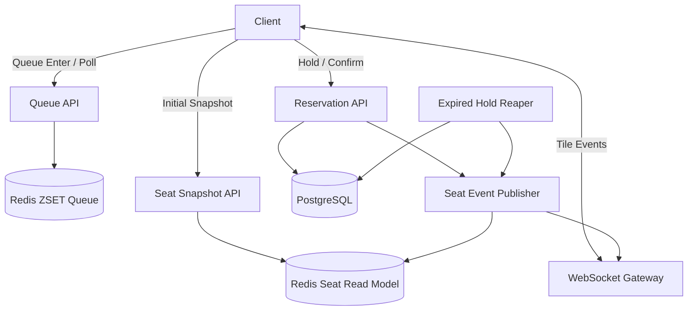

# Rushmore Seat

대규모 예매 오픈 상황을 가정한 좌석 예약 시스템.

목표는 단순 예약 CRUD가 아니라, **대기열 기반 트래픽 제어**, **10만 좌석 실시간 상태 동기화**, **좌석 선점 경쟁 완화**, **초과 예약 방지**, **부하 테스트 기반 성능 검증**을 구현하는 것이다.

---

## Core Goals

- 10만 좌석 규모의 공연 회차를 생성한다.
- Redis 대기열로 예매 화면 진입량을 제어한다.
- admission token을 받은 사용자만 좌석 선택 화면에 진입한다.
- 사용자는 전체 좌석이 아니라 현재 보고 있는 sector/tile의 좌석 상태만 WebSocket으로 수신한다.
- 좌석 클릭 시 즉시 hold 요청을 수행한다.
- 좌석 hold는 PostgreSQL 조건부 update 성공 시에만 인정한다.
- hold된 좌석은 TTL 내에 confirm되지 않으면 release된다.
- 최종 예약 수는 실제 좌석 수를 초과하지 않아야 한다.

---

## Domain Model

공연장 구조와 예매 회차 상태를 분리한다.

```text
Venue
  └─ Hall
      └─ SeatMap
          ├─ Sector
          ├─ Tile
          └─ Seat

Performer
  └─ Show
      └─ Performance
          └─ PerformanceSeat
              └─ Reservation
```

핵심 원칙:

- `Seat`는 고정 좌석 배치 정보다.
- `PerformanceSeat`는 특정 공연 회차에서의 좌석 상태다.
- `Performance`의 PK는 별도 surrogate id를 사용한다.
- `PerformanceStatus`는 공연 자체 상태만 표현한다.
- `PerformanceSalesStatus`는 예매 판매 상태만 표현한다.
- `starts_at`, `ends_at`, `hall_id`는 공연 회차의 속성으로 두고 PK나 unique identity로 쓰지 않는다.
- 시간 범위 중복 방지는 MVP에서는 DB constraint로 강제하지 않는다. 필요 시 service validation 또는 PostgreSQL exclusion constraint로 확장한다.

---

## Performance Status

공연 상태와 판매 상태는 분리한다.

```text
PerformanceStatus
- SCHEDULED
- COMPLETED
- CANCELLED

PerformanceSalesStatus
- BEFORE_SALE
- ON_SALE
- CLOSED
```

`ends_at`은 예정 종료 시각일 뿐이다. 실제 공연 종료 여부는 운영적으로 `COMPLETED` 전이를 통해 확정한다.

예매 가능 여부는 두 조건을 함께 본다.

```text
PerformanceStatus == SCHEDULED
and PerformanceSalesStatus == ON_SALE
```

---

## Seat State

RDB에 저장되는 좌석 상태는 최종 의미가 있는 상태만 둔다.

```text
AVAILABLE
  -> HELD
  -> RESERVED
```

| State | Meaning |
|---|---|
| AVAILABLE | 선택 가능 |
| HELD | 특정 사용자가 제한 시간 동안 임시 선점 |
| RESERVED | 예약 확정 |

`CLAIMING`은 RDB 상태로 저장하지 않는다. 클릭 처리 중 상태가 필요하면 Redis claim gate 또는 WebSocket transient event로만 표현한다.

---

## Queue / Admission

대기열은 Redis Sorted Set으로 관리한다.

```text
queue:waiting:{performanceId}
member = userId
score  = joinedAtMillis
```

```text
Queue passed = seat selection screen admission
Queue passed != seat reserved
```

100만 부하는 모든 요청을 예약 처리까지 통과시키는 것이 아니라, 대기열에서 흡수하고 실제 write path 유입량을 제한하는 방식으로 처리한다.

```text
1,000,000 queue enter attempts
  -> Redis waiting queue
  -> admission control
  -> 5,000 ~ 20,000 admitted users
  -> 1,000 ~ 5,000 WebSocket clients
  -> 50,000 ~ 200,000 hold attempts
  -> 300 ~ 500 rps PostgreSQL conditional update
```

---

## Sector / Tile Subscription

10만 좌석 전체 변경 이벤트를 모든 사용자에게 broadcast하지 않는다.

```text
SeatMap
 ├─ Display Sector A
 │   ├─ Tile A-01: 약 500 seats
 │   ├─ Tile A-02: 약 500 seats
 │   └─ ...
 ├─ Display Sector B
 └─ Display Sector C
```

| Concept | Purpose |
|---|---|
| Sector | 사용자에게 보이는 공연장 구역 |
| Tile | Sector 내부의 경량 로딩 / WebSocket 동기화 단위 |

기본 목표:

```text
Total seats: 100,000
Default tile size: 500 seats
Subscription tiles: 약 200
Client subscribed tiles: 1 ~ 3
Batch interval: 100ms
Batch max changes: 200
```

Sector 진입 시 전체 Tile summary만 로드하고, 실제 Seat 상세는 사용자가 보는 Tile에 대해서만 조회한다.

```text
Sector 선택
  -> Tile summary 조회
  -> Tile별 잔여 상태를 색상이나 밀도로 표시
  -> 필요한 Tile의 Seat 상세 조회
  -> 필요한 Tile의 좌석 변경만 구독
```

느린 클라이언트의 outbound queue가 밀리면 오래된 delta를 계속 쌓지 않고 `TILE_RESYNC_REQUIRED`를 전송한 뒤 snapshot 재조회로 복구한다.

---

## Seat Map Position Terms

표시값과 계산값을 분리한다.

```text
rowLabel = 사용자에게 보이는 행 표시값. 예: AA
colLabel = 사용자에게 보이는 열/좌석 표시값. 예: 13
rowNo    = 내부 계산용 행 번호
colNo    = 내부 계산용 열 번호
```

Tile의 row/col 범위는 실제 좌석 도형이 아니라 bounding box다. Sector 또는 Tile이 반드시 직사각형일 필요는 없다. 실제 좌석 존재 여부는 `Seat` 목록으로 표현한다.

MVP에서는 polygon, row offset, row별 seat count 같은 정밀 layout metadata는 관리하지 않는다.

---

## Architecture



Scaling target:

```text
Load Balancer
  ├─ app-1: HTTP API + WebSocket
  ├─ app-2: HTTP API + WebSocket
  ├─ app-3: HTTP API + WebSocket
  └─ app-4: HTTP API + WebSocket

Redis primary
PostgreSQL primary
Redis Pub/Sub backplane for WebSocket fanout
```

Replica 판단:

- API / WebSocket app replica는 필요하다.
- PostgreSQL read replica는 핵심 예약 처리 성능에는 직접 도움이 되지 않는다. `AVAILABLE -> HELD` 전이는 primary write이기 때문이다.
- Redis replica는 write scale-out 수단이 아니라 HA 또는 read offload 용도다.
- 여러 WebSocket app replica를 둘 경우 Redis Pub/Sub 기반 backplane으로 seat state event를 전파한다.

---

## API Draft

현재 skeleton은 `events/assets` 명칭을 사용한다. 도메인 정리 후 `performances/performance-seats` 기준으로 변경한다.

Target API shape:

```http
POST /performances/{performanceId}/queue
GET  /performances/{performanceId}/queue/me

GET /performances/{performanceId}/sectors/summary
GET /performances/{performanceId}/sectors/{sectorId}/tiles/summary
GET /performances/{performanceId}/tiles/{tileId}/seats

WS /ws/performances/{performanceId}?token={admissionToken}

POST /performances/{performanceId}/seats/{performanceSeatId}/hold
POST /performances/{performanceId}/reservations/confirm
```

---

## Hold Strategy

Baseline에서는 Redis claim gate 없이 PostgreSQL 조건부 update만 사용한다.

```sql
UPDATE performance_seat
SET
    status = 'HELD',
    hold_member_id = :memberId,
    hold_token = :holdToken,
    hold_expires_at = now() + interval '3 minutes',
    version = version + 1,
    updated_at = now()
WHERE id = :performanceSeatId
  AND performance_id = :performanceId
  AND status = 'AVAILABLE';
```

```text
affected rows = 1 -> hold success
affected rows = 0 -> already held or reserved
```

DB row lock은 transaction 동안만 짧게 유지한다. 사용자 결제/확정 대기 시간 동안 DB transaction이나 connection을 유지하지 않는다. 임시 점유는 `HELD + hold_expires_at` lease로 표현한다.

Redis claim gate는 2차 개선안으로 추가한다.

```text
without Redis gate:
- 모든 hold 시도가 DB conditional update까지 도달

with Redis gate:
- 같은 좌석의 동시 클릭 중 하나만 DB hold path로 진입
- 나머지는 Redis SET NX PX 단계에서 빠르게 실패
```

비교 지표:

- hold API p50 / p95 / p99
- DB update latency
- DB lock wait
- DB connection pool usage
- failed update count
- hot-seat contention scenario throughput

---

## Hold Timeout Recovery

hold 상태는 DB connection 유지가 아니라 만료 시각으로 관리한다.

```text
HELD and hold_expires_at < now()
  -> AVAILABLE
  -> reservation EXPIRED
  -> WebSocket SEAT_RELEASED
```

confirm 시점에도 `hold_expires_at > now()` 조건을 함께 검증한다. 서버 장애나 WebSocket event 누락이 있어도 DB 상태와 만료 worker를 기준으로 복구한다.

---

## Load Test Plan

| Tier | Purpose | Target |
|---|---|---:|
| Smoke | 기능 검증 | 10,000 queue enter attempts |
| MVP | 로컬 성능 기준 | 100,000 queue enter attempts |
| Target | 포트폴리오 기준 | 1,000,000 queue enter attempts |
| Stretch | 분산 부하 테스트 | 2,000,000+ queue enter attempts |

Target scenario:

```text
total seats: 100,000
queue enter attempts: 1,000,000
admitted users: 5,000 ~ 20,000
WebSocket clients: 1,000 ~ 5,000
subscribed tiles per client: 1 ~ 3
hold attempts: 50,000 ~ 200,000
hold request rate: 300 ~ 500 rps
confirm attempts: 1,000 ~ 10,000
```

핵심 지표:

- queue enter p50 / p95 / p99
- tile snapshot p50 / p95 / p99
- hold API p50 / p95 / p99
- WebSocket propagation p50 / p95 / p99
- false-positive click failure rate
- oversell count
- duplicate hold count
- Redis ops/sec
- PostgreSQL connection pool usage
- WebSocket outbound bytes/sec

MVP success criteria:

```text
1. 100,000 seats 생성 가능
2. Redis 대기열로 선택 화면 진입 제어 가능
3. 사용자는 현재 보고 있는 tile 이벤트만 WebSocket으로 수신
4. 좌석 hold는 PostgreSQL 조건부 update로만 성공 처리
5. oversell count = 0
6. duplicate hold count = 0
7. false-positive click failure rate < 0.5%
8. hold API p95 < 500ms
9. WebSocket propagation p95 < 300ms
10. Redis claim gate 추가 전후 hot-seat contention 비교 리포트 작성
```

---

## Tech Stack

| Area | Stack |
|---|---|
| Language | Kotlin |
| Runtime | Java 21 |
| Backend Framework | Spring Boot 3.5.16 |
| Build | Gradle |
| HTTP API | Spring MVC |
| Realtime | Spring WebSocket |
| WebSocket Backplane | Redis Pub/Sub |
| Database | PostgreSQL |
| DB Access | JPA, JdbcClient/JdbcTemplate for hot path SQL |
| Migration | Flyway |
| Cache / Queue / Claim Gate | Redis |
| Frontend | Vite, Vanilla TypeScript, HTML, CSS |
| Seatmap Rendering | Canvas |
| Load Test | k6 |
| Metrics | Spring Boot Actuator, Micrometer, Prometheus |
| Dashboard | Grafana |
| Test | JUnit5, Testcontainers |
| Runtime | Docker Compose |

---

## Project Naming

| Target | Name |
|---|---|
| Repository | `rushmore-seat` |
| Gradle root project | `rushmore-seat` |
| Spring application | `rushmore-seat` |
| Frontend package | `rushmore-seat-frontend` |

Kotlin package path는 당장은 `com.eooog.rushseat`을 유지한다. 대규모 package rename은 도메인 리팩터링과 함께 별도 작업으로 처리한다.

---

## Current Implementation Status

현재 구현은 1차 skeleton이다.

Implemented:

- Redis queue enter / queue status / manual admission
- admission token validation
- sector summary 조회
- tile seat snapshot 조회
- raw WebSocket tile subscription
- PostgreSQL conditional update 기반 hold
- reservation row 생성 및 confirm 기초 흐름
- Vite + Vanilla TypeScript + Canvas 기반 최소 프론트
- Venue / Hall / SeatMap / Sector / Tile / Seat / Show / Performer / Performance 도메인 일부 반영

Next:

- `event/asset` 명칭을 `performance/performance_seat`로 정리
- 10만 seat seed runner 추가
- expired hold reaper 구현
- Redis read model 도입
- WebSocket batch/coalescing 및 Redis Pub/Sub backplane 적용
- Redis claim gate 추가 전후 부하 테스트 비교
- k6 부하 테스트 스크립트 작성
